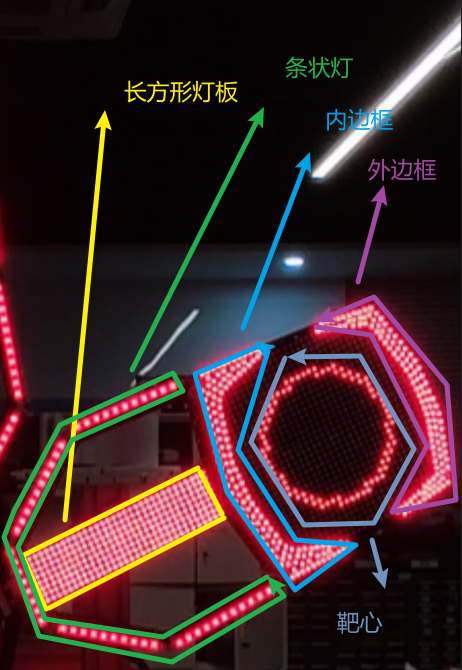
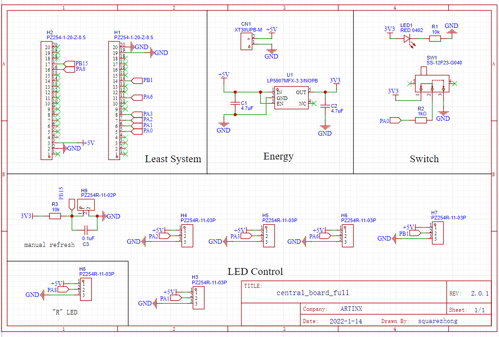
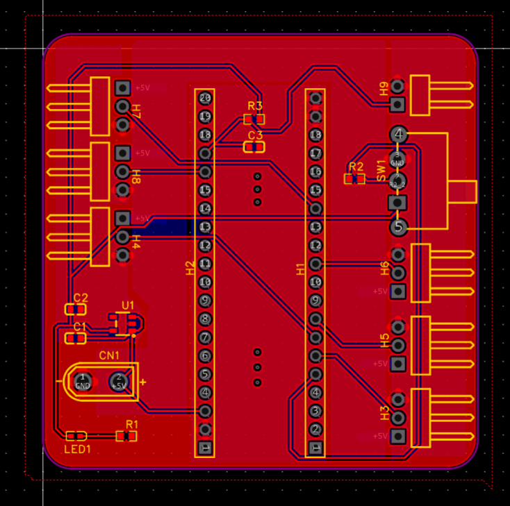
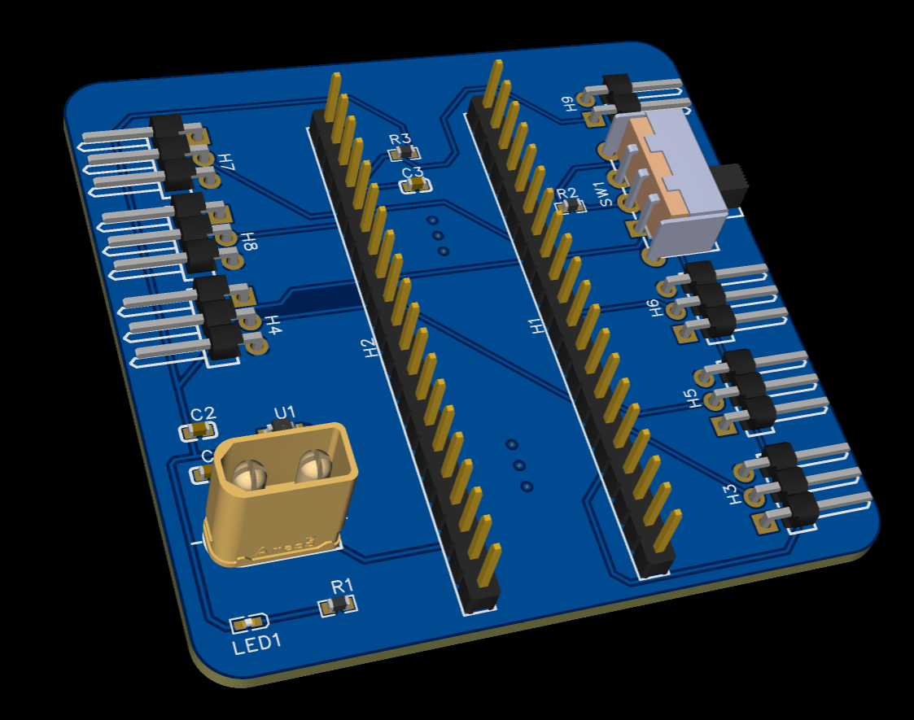
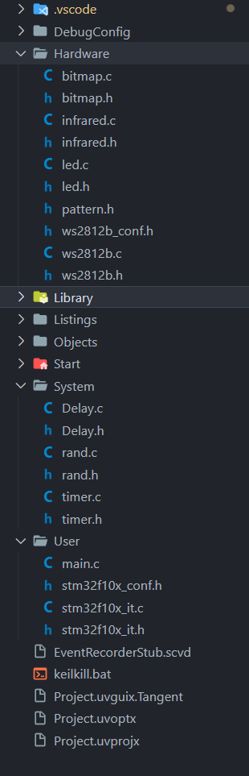
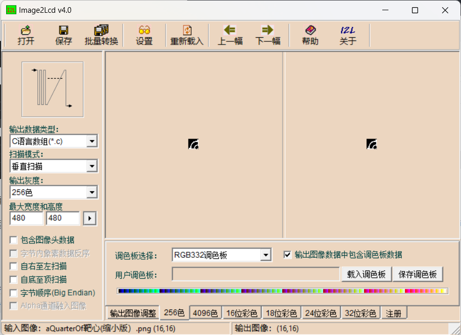
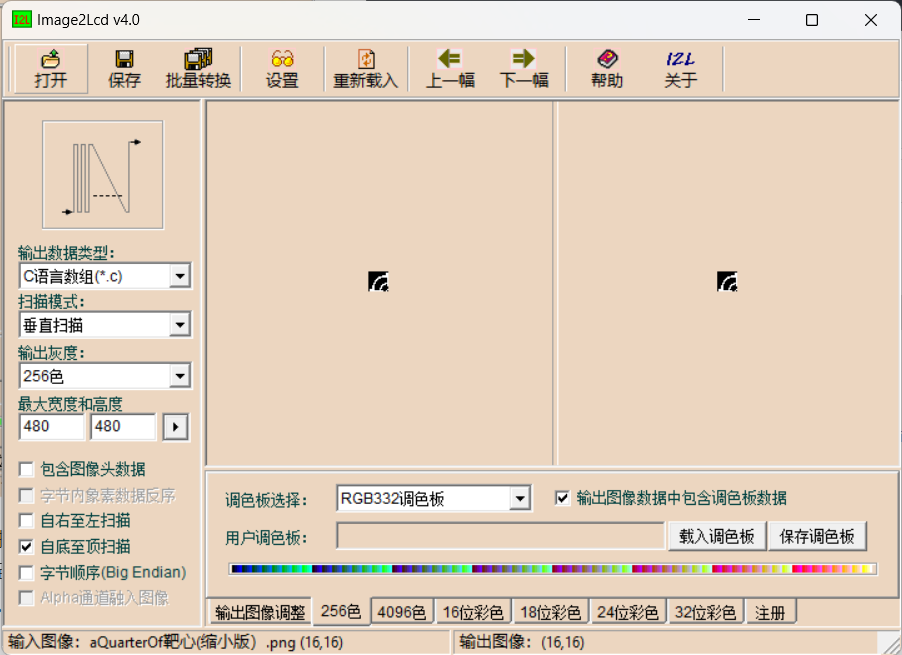

# 能量机关文档

> 南方科技大学ARTINX战队
>
> 作者：黄亭钧（23赛季硬件）

## 前言

### 基本思路

能量机关的软件控制原理简单来说，可以分成三个部分：

1. 3508电机驱动能量机关按照规则要求旋转
2. 灯板按照官方要求点亮
3. 打击检测

其中第1点，实现起来非常简单，基本上来个电控就能做，如果搭配A板和DR16，还可以通过DT7遥控器来远程操控。

第2点，我们选用的是LED灯是WS2812B，通过一定的代码逻辑可以控制灯按照官方的要求点亮。

第3点，由于时间问题，我们没有做打击检测，但是预留了打击检测的接口，只需要以后接入了合适的传感器后，通过修改全局数组就可以实现打击检测；目前，为了方便视觉调车，我们采用了红外遥控的方式来代替打击检测以实现叶片显示能量机关被击打后的状态。


而本文档只讲述第2.3点的代码实现。


### 我们的符是怎么来的？

本赛季的能量机关，我们最后是借用了深圳技术大学-悍匠战队的，再次感谢悍匠的慷慨帮助。

悍匠大符在设计上已经十分接近完整形态，基本上只有靶心处缺少LED灯板以及打击检测的功能，其他在设计上已经相当完善了。当然还存在一些可以优化的地方，比如：内外边框可能PCB设计存在信号干扰的情况，过大电流（灯珠亮度大）的时候，会出现偶尔出现颜色与发送包的颜色不符的情况；另外由于各个灯板直接采用接头或者杜邦线连接，容易出现接触不良的情况（具体表现为颜色有时不对或者时亮时不亮的情况），这个问题后续基本上通过将插头改成焊线解决。

*注：上面及之后对于灯板的指代都请参考下图。*




在软件和主控硬件上，我们还是采用了自己的方案。

## 主控板

由于时间原因，我们的主控板是延续了上个赛季大符的主控板，但实际上，由于添加了红外接收功能（打击检测）并且重写了代码，而且为了兼容悍匠的符，主控板实际上与原理图中的标注会有些出入。








以上，分别是主控板的原理图，PCB和3D渲染图，由于PCB背面没有元件，因此上图只放了正面。

**注意下面:**

- 这个PCB中间的两排排针，实际上是STM32F103C8T6最小系统板
- H9的2pin引脚，本赛季弃用
- SW1，本赛季将开关改成了3pin排针，用于给R标输出PWM信号
- H5，由于在修改代码的时候，发现与另外一个引脚的DMA通道冲突了，所以改成了输入捕获引脚，外接红外接收头（正好也是三个引脚：5V, GND, OUT）
- 其他的3pin排针（H3,4,6,7,8），都用于给一片叶面发送PWM信号；另外，由于悍匠大符的灯都有独立供电，因此，这里实际上只有中间的一个引脚用于输出PWM信号，另外的两个引脚悬空即可
- XT30的输入是5V供电，如果需要用官方电池供电的话，需要自己外接一个24-5V的变压器
- 在实际接线的时候，由于灯的数量太多（单片叶面1500+），虽然灯是并联在5V的供电上，但由于线路压降，后面的灯供电会达不到5V，因此，需要在后面追加一个5V供电，把电压拉上去


**在进入代码部分之前，请先阅读ws2812b的数据手册。**

**关于一个叶片上的灯板，连接顺序是这样的：长方形灯板->条状灯->内边框->靶心->外边框**

## 代码部分

[Tangent-H/RM2023_Energy_Mechanism: ARTINX LED Code for RM_2023_Energy_Mechanism (github.com)](https://github.com/Tangent-H/RM2023_Energy_Mechanism)

最新的代码已经放到github上面去了，队里的gitlab上也有能用的版本，但是颜色和图案并不是最终的版本。

### 驱动部分

LED驱动代码是从下面这个开源的代码改过来的：

[Silencer2K/stm32f10x-ws2812b-lib: STM32 WS2812B library (github.com)](https://github.com/Silencer2K/stm32f10x-ws2812b-lib)

这份驱动是用标准库写的，但是仅支持输出一路PWM信号，但是我们希望能够输出6路PWM信号（5个叶片+1个R标），因此需要进行一些ctrl c，ctrl v还有一些参数的修改。

具体的代码和主控板上输出的映射见下：

H3->PA1->TIM2_CH2->DMA1_CH7（叶面）

H4->PA2->TIM2_CH3->DMA1_CH1（叶面）

H5->PA3->TIM2_CH4->DMA1_CH7	（和第一路的DMA通道冲突了，弃用；改接红外接收头）

H6->PA6->TIM3_CH1->DMA1_CH6（叶面）

H7->PB1->TIM3_CH4->DMA1_CH3（叶面）

H8->PA8->TIM1_CH1->DMA1_CH2（叶面）

H9->PB15（2pin，弃用）

开关接的GPIO口(SW1)->PA0->TIM2_CH1->DMA1_CH5（R标）


以下这些文件是ws2812b的驱动代码：

```
bitmap.c
bitmap.h
ws2812b.c
ws2812b.h
ws2912b_conf.h
```

这份代码的驱动使用起来非常简单（下面这个是从原作者的仓库中摘下来的实例，在本代码中没有）

```c
#include "ws2812b.h"

#define NUM_LEDS    300

RGB_t leds[NUM_LEDS];

int main() {
    ws2812b_Init();

    while (1) {
        while (!ws2812b_IsReady()); // wait

        //
        // Fill leds buffer
        //

        ws2812b_SendRGB(leds, NUM_LEDS);
    }
}
```

简单来说，while循环前调用`ws2812b_Init()`函数初始化，后续只需要等`ws2812b_IsReady()`后，填充LED的数组，然后调用`ws2812b_SendRGB()`发包即可，原作者的代码中，还支持用HSV格式来发包，这里我们就不用了，实际上就是通过一个函数来将RGB和HSV进行互转。

需要注意的是，PA8端口由于是与高级定时器相连，与其他端口连的通用定时器不一样，代码上需要注意使能PWM输出需要多加一句话：

```c
TIM_Cmd(TIM1, ENABLE);
TIM_CtrlPWMOutputs(TIM1,ENABLE);    //高级定时器主输出使能需要这一句
DMA_Cmd(DMA1_Channel2, ENABLE);
```


至于为什么驱动部分要重写，最主要的原因是因为stm32f103c8t6内存有限，新赛季的大符由于增加了靶心的灯板，原来的代码由于在内存使用上还不够高效（使用了24bytes来表示24bits的数据），因此如果直接改原来的代码会出现爆内存的现象。

### 逻辑部分

这份代码的逻辑基本上是沿用了上个赛季钟吴子正同学的。



代码的目录结构大致如上，其中比较重要的事Hardware、System、User三个文件夹，其他文件夹都是标准库的内容。

*Hardware中*：

`bitmap.c` `bitmap.h` `ws2812b.c` `ws2812b.h` `ws2812b_conf.h` 都是ws2812b的驱动层代码。

`infrared.c` `infrared.h`是红外接收的检测和响应的代码。

`pattern.h`里面存放的是一些标准图形（比如待激活状态下的箭头图案，靶心的图案）

`led.c` `led.h`里面存放了控制能量机关按照期望的图案、颜色显示的上层函数


*System中*：

`Delay.c` `Delay.h` 里是利用systick来实现的延迟函数。

`rand.c` `rand.h`里存放了随机指定叶片的函数（后续发现其实没有必要，因为一开始希望能够通过一些办法，比如adc噪声来生成随机种子，这样可以保证开机之后刷新的叶片是完全随机的，但后来发现，库里自带的rand函数也够视觉用了）

`timer.c` `timer.h` 的作用有三个：

- 给叶片移动的箭头指定一个确定的刷新频率（后来发现基本没用，刷新频率高了叶片数据不知道为什么很容易出现不正确的情况，最后其实刷新频率还是由每次更新delay的时间来决定的）
- 计时2.5s，每2.5s就要让能量机关切换一片叶面
- 为红外接收的时序提供一个计时单元


*User*:

`main.c`是程序启动的入口


首先从`main.c`开始看

*main.c*

```c
#include "stm32f10x.h" // Device header
#include "led.h"
#include "infrared.h"
#include "Delay.h"


int main(void)
{
	IR_Init();
	LED_Init(RedState);	
	
	while (1)
	{
		Delay_ms(100);
		while(!ws2812b_IsReady());
		LED_Update();
	}
}

```

前面两行初始化了红外接收模块和LED（默认显示红方），然后进入一个while死循环，为了保证叶片的数据传输正确，先有一个100ms的延迟（至于为什么是100ms，其实完全是试出来的）。然后检查传输是否准备好了（虽然其实LED_Update()函数里面也有检查，但由于叶片经常会由莫名奇妙的颜色偶尔出现异常，因此我就多加了几句“比较冗余”的`ws2912b_IsReady()`的检测），接着就跟据当前的一些全局变量信息来更新LED显示。


接下来，最重要的文件也就是`led.c` `led.h`了，`pattern.h`给`led.c`提供如何生成指定图案的方式，`infrared.c`在接收到红外线的外部中断后，会对红外信号的时序解码，然后据此来修改`led.c`中确定当前状态的全局变量。


下面是led.h中的函数声明


```c
void LED_Init(LED_State_t state);
void LED_PackLightALLData(void);
//装载将叶片上所有灯都点亮的数据（测试灯珠是否正常、数据发送是否正常时用）

void LED_PackRectangleData(LED_Leaf_Mode_t leafmode, RGB_t * dst);
//装载长方形灯板数据
void LED_PackStripData(LED_Leaf_Mode_t leafmode, RGB_t * dst);
//装载条状灯数据
void LED_PackFrameData1(LED_Leaf_Mode_t leafmode, RGB_t * dst);
//装载内边框数据
void LED_PackFrameData2(LED_Leaf_Mode_t leafmode, RGB_t * dst);
//装载外边框数据
void LED_PackTargetData(LED_Leaf_Mode_t leafmode, RGB_t * dst);
//装载靶心数据


void LED_Update(void);
```


逻辑实现上是：

`void LED_Update(void)`首先会调用在`led.c`中定义的一个函数（不对外使用）`void check_LED_Status(void)`，以此确定当前能量机关的状态（能量机关的状态基本上都`led.c`中的这些全局变量来控制了），

```c
uint8_t debug = 0;  //debug = 1模式下叶片不会2.5s切换，方便视觉对同一个叶片持续调参
uint8_t timeout = 0;       // 如果时间到了(2.5s)，timeout = 1，由定时器硬件中断修改
uint8_t refresh_rectangle = 0; // 如果刷新灯板（指的是让长方形灯板里面的箭头流动起来）时间到了，refresh_rectangle = 1，由定时器中硬件中断修改
uint8_t leaf_ring_value[5] = {0, 0, 0, 0, 0};   //取值范围0-4，分别对应2环，4环，6环，8环，10环(这些环数比较粗略，而且10环弄错了，我这里没有定义10环的图案，这个后续跟据情况改吧)
static LED_Leaf_Name_t current_Refresh_Leaf = LEAF_0; // 默认为第一片叶子,表示当前在刷新的扇叶

static RGB_t leds[LED_NUM];    //存放led点亮数据的地方
static RGB_t R_logo[64];   //存放R标的数据

LED_Leaf_Mode_t leafmode[5] = {LEAF_OFF, LEAF_OFF, LEAF_OFF, LEAF_OFF, LEAF_OFF}; //存放每片叶子当前的状态，默认为关闭
RGB_t current_color = {0, 0, 0}; //变量，表示这片叶子亮哪方的颜色（其实有后面的LED_State就可以判断了，但是为了减轻CPU负担，尽量在颜色判断上只在初始化的时候判断一次）


LED_State_t LED_State = RedState; //能量机关默认为红方模式
uint8_t currentLeafStruck = 0;· //当前叶子是否击中了
LED_Leaf_Name_t current_striking_leaf = LEAF_0; //当前击打的扇叶
uint8_t total_struck = 0; //总共击打的次数
```

然后按照灯板级联的顺序，依次将数据装载到发包的buffer中，然后一次性将包发出去，这样我们就能够点亮一个叶片；

其他的叶片我们也是放到同一个buffer中去发，因此，实际上需要去依次遍历每个叶片，而不是一次性把所有叶片的数据都发出去。


另外，简单地说一下`pattern.h`中数组的含义：

```c
const unsigned char TARGET_STRIKING[1024] = {
0,0,0,0,0,0,0,0,0,0,0,0,0,0,0,0,
0,0,0,0,0,0,0,0,0,0,0,0,0,0,1,1,
1,1,0,0,0,0,0,0,0,0,0,0,0,0,0,0,
...
};
```

比如说上面这个数组，存储的就是靶心上1024个灯在能量机关待击打状态时的亮灭情况，也就是以下这个靶心的图案（不含边框）


1代表这个灯要点亮，0代表整个灯要熄灭。

另外有个小点需要注意，我们在`pattern.h`存放的都是`const`变量，这么定义也是有原因的，因为`const`变量会存放在MCU中内存更大的flash中，而不是RAM中，因为`pattern.h`中确实存放了太多的数据。

但是，按理说`pattern.h`只能存放不会变的数据，那像移动的箭头这种图案又是如何实现的呢？

其实原理也很简单，因为毕竟存下来的是一个0，1数组，但最后要发包的确是`RGB_t`数组，因此我们无论如何都还是要去遍历`pattern.h`中的数组的，而要想实现动画的效果，只需要保证每一次遍历选择的起始位置不同就可以了（不过后来据说视觉那边不需要动画也可以）。


那么，现在最大的问题是，这个这么庞大的数组，总不可能手写吧？

当然不会，这里我用到了一个工具叫`Img2Lcd`

这个软件可以直接将图片转换为c语言数组，而且是按照ws2812b这种线性点亮方式的。


比如说：


上面这张图就是我用*Photoshop*画的一个16*16的1/4个靶心在待激活状态下的形状。

由于对称性，其他的3/4个靶心其实也是显示这样的图案，只需要复制三份就可以点亮一个完整的靶心图案。


按照下面这个设置，导出数组，我们就得到了从顶至底扫描的数据，导出的是16进制的256色颜色值，这里为了语义上更好理解，我把里面的`0xFF`都替换成了`1`，把`0x00`都替换成了`0`。



当然，大部分的ws2812b灯板都是奇数列和偶数列的扫描方向相反，这里我的处理方式是，先通过上面的方式生成`奇数列的数据`，然后再改成自底至顶扫面，生成`偶数列数据`；接着再将这两个数据手动融合一下，就能得到正确的图案数组。




